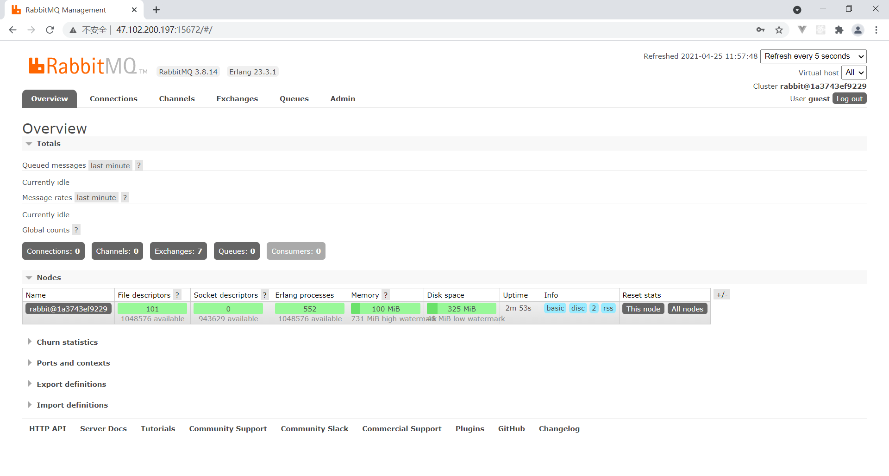
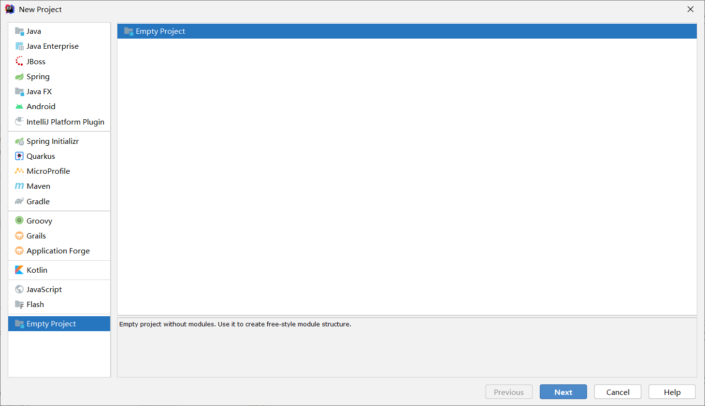
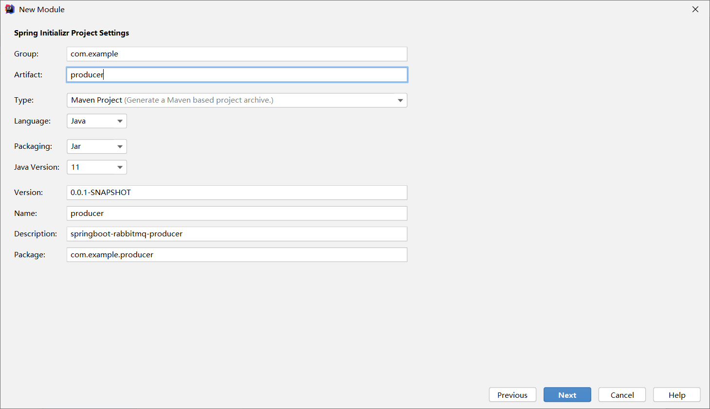
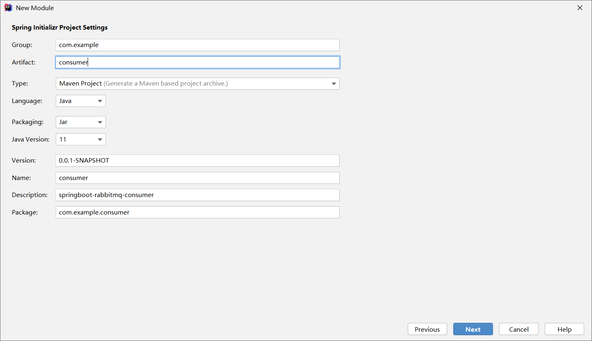
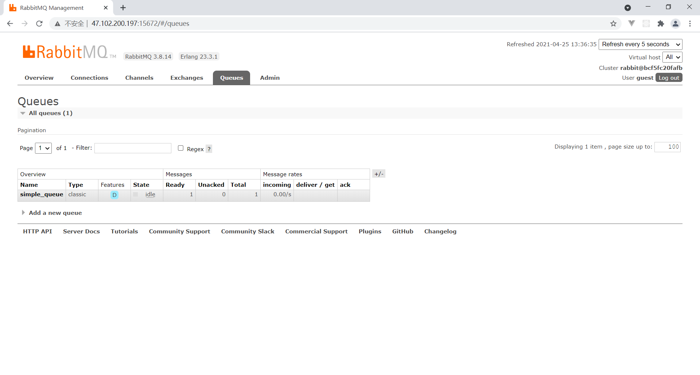
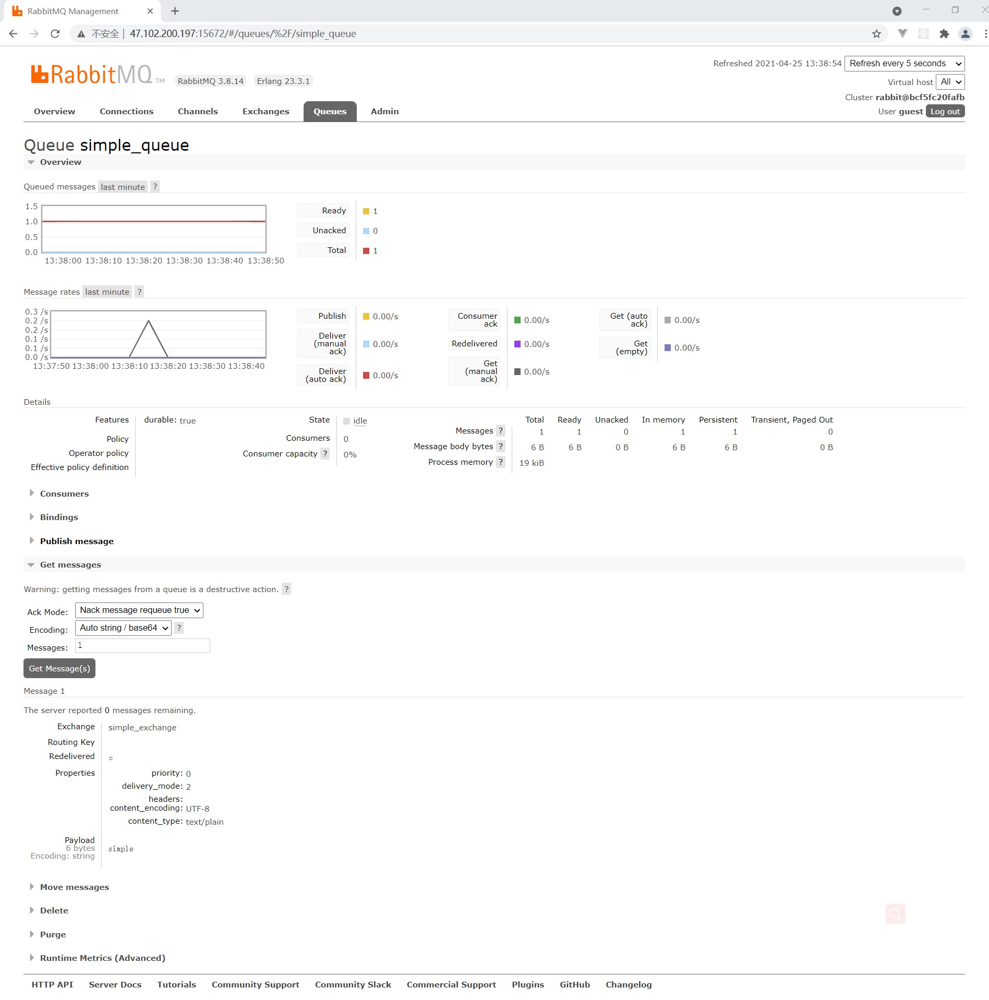
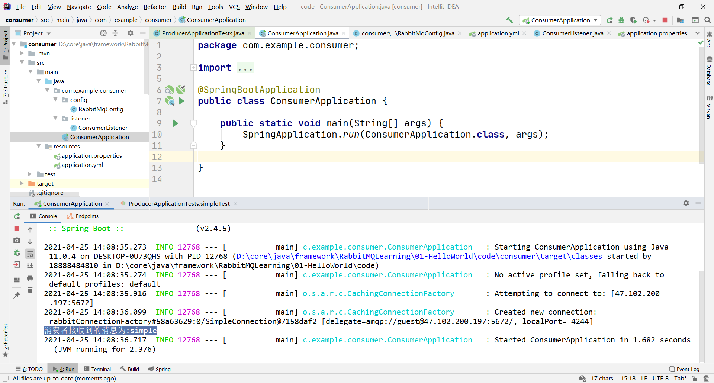
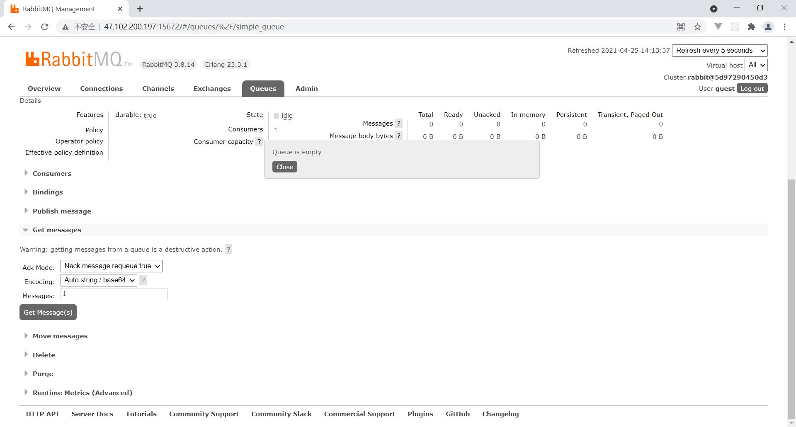

# 关于 RabbitMQ

-  [官网](https://www.rabbitmq.com/) 
-  [RabbitMQ-getstarted.html](references\RabbitMQ-getstarted.html) 

# 安装 rabbitmq

## linux 下 docker 安装

### 下载镜像

下载镜像（有时候网络问题超时，多尝试几次即可。我这里选择的是可以访问web管理界面的tag）

```sh
sudo docker pull rabbitmq:management
```

### 创建容器并运行

创建容器并运行。15672是管理界面的端口，5672是服务的端口，默认账号密码为：`guest`

```sh
docker run -dit --name Myrabbitmq -p 15672:15672 -p 5672:5672 rabbitmq:management
```

需要设置管理系统的用户名为 `admin`、密码为 `password` 的用下面这条：

```sh
docker run -dit --name Myrabbitmq -e RABBITMQ_DEFAULT_USER=admin -e RABBITMQ_DEFAULT_PASS=password -p 15672:15672 -p 5672:5672 rabbitmq:management
```

### 登录管理界面

**15672** 是管理界面的端口。如果你是本地安装，访问 http://localhost:15672 ，如果你是像我一样使用阿里云，那么访问 http://IP:15672 ，输入账号密码，有如下效果：



# Spring Boot 整合 RabbitMQ

## 创建工程

1. 创建一个 `Empty Project` 
2. 在创建的 `Empty Project` 下用 **Spring Initializr** 创建 `producer` 、`consumer`







## producer

### 导入坐标

 [pom.xml](code\producer\pom.xml) 

```xml
		<dependency>
			<groupId>org.springframework.boot</groupId>
			<artifactId>spring-boot-starter-amqp</artifactId>
		</dependency>
```

### 编写配置文件

 [application.yml](code\producer\src\main\resources\application.yml) 

```yml
spring:
  rabbitmq:
    host: 你的主机 IP 地址
    port: 5672
    virtual-host: 你的虚拟主机,rabbitmq 默认为 `/`
    username: 你的密码,rabbitmq 默认为 `guest`
    password: 你的密码,rabbitmq 默认为 `guest`
server:
  port: 随便选一个，但记得要与 `consumer` 不同

```

### 编写配置类

 [RabbitMqConfig.java](code\producer\src\main\java\com\example\producer\config\RabbitMqConfig.java) 

### 测试

 [ProducerApplicationTests.java](code\producer\src\test\java\com\example\producer\ProducerApplicationTests.java) 

```java
	@Resource
	private RabbitTemplate rabbitTemplate;

	@Test
	public void simpleTest(){
		rabbitTemplate.convertAndSend(RabbitMqConfig.SIMPLE_EXCHANGE_NAME,"","simple");
	}
```

#### 效果

1. 在 **Queues** 下可见 `simple_queue` 
2. 点击 `simple_queue` 进入其相关页面。点击展开 **Get messages** ，再点击 **Get Message(s)** 按钮，在 **Payload** 下可见 Java 程序发生送的消息 `simple` 





## consumer

### 导入坐标

 [pom.xml](code\consumer\pom.xml) 

```xml
		<dependency>
			<groupId>org.springframework.boot</groupId>
			<artifactId>spring-boot-starter-amqp</artifactId>
		</dependency>
```

### 编写配置文件

 [application.yml](code\consumer\src\main\resources\application.yml) 

### 编写配置类

 [RabbitMqConfig.java](code\consumer\src\main\java\com\example\consumer\config\RabbitMqConfig.java) 

### 编写 Listener

 [ConsumerListener.java](code\consumer\src\main\java\com\example\consumer\listener\ConsumerListener.java) 

### 测试

启动 [ConsumerApplication.java](..\..\..\..\..\学习\2-消息中间件RabbitMQ\代码\rabbitmq\rabbitmq\springboot-rabbitmq-consumer\src\main\java\com\itheima\rabbitmq\ConsumerApplication.java) 

#### 效果

- 控制台：收到了队列 **simple_queue** 里的消息 `simple`
- 管理界面：原来 **producer** 发送到队列 **simple_queue** 的消息被消费掉了，再点击 **Get Message(s)** 会显示 **Queue is empty** 






#  [Work queues](https://www.rabbitmq.com/tutorials/tutorial-two-python.html) 

 [ConsumerListener.java](code\consumer\src\main\java\com\example\consumer\listener\ConsumerListener.java) 

```java

    // worker 模型默认公平模型~
    @RabbitListener(queuesToDeclare=@Queue(value = "work"))
    private void receiveMsgWork1(String msg){
        System.out.println("worker_1:"+msg);
    }

    @RabbitListener(queuesToDeclare=@Queue(value = "work"))
    private void receiveMsgWork2(String msg){
        System.out.println("worker_2:"+msg);
    }
```

 [ProducerApplicationTests.java](code\producer\src\test\java\com\example\producer\ProducerApplicationTests.java) 

```java
	@Test// worke queues 模型
	void test_work_queue() {
		for (int i = 0; i < 10; i++) {
			rabbitTemplate.convertAndSend("work", "worker 模型"+i);
		}
	}
```

#  [Publish/Subscribe](https://www.rabbitmq.com/tutorials/tutorial-three-python.html) 


